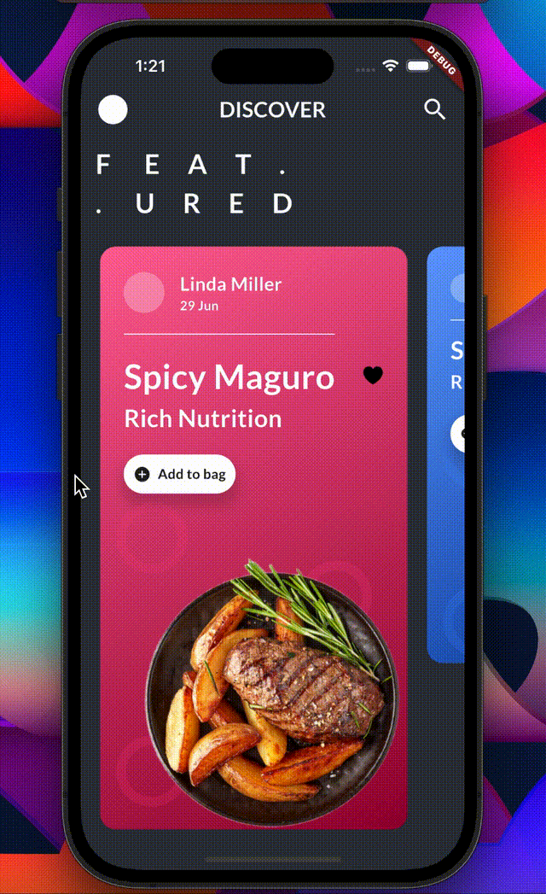
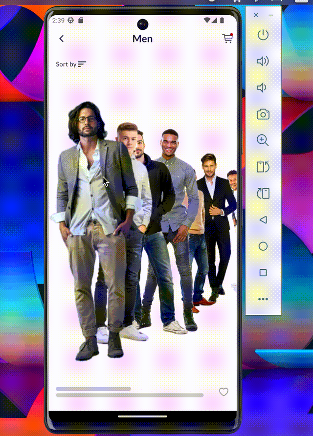
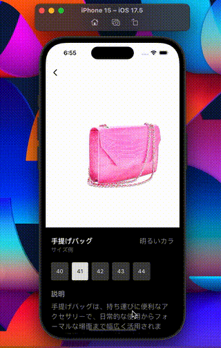

  

  
  
  
  

### Hey there👋,

  

I am an excellent Mobile Application developer with years of experience. Besides programming, I love reading books, playing chess and surfing the net.

- 🌱 I’m currently increasing my problem-solving abilities by tackling questions on Leetcode. 
- 👯 I’m looking to collaborate on projects involving Flutter and Spring Boot. 
- 💬 I would love to talk with you on DSA and System Design :) 
- 😄 Pronouns: He/Him

### :hammer_and_wrench: Languages and Tools :

  &nbsp;
  &nbsp;
  &nbsp;  
  &nbsp;
  &nbsp;
 &nbsp;
<!--   &nbsp; -->
 &nbsp;
 &nbsp;
<!--  &nbsp; -->
  &nbsp;
  &nbsp; 

### :fire: My Stats :
* 
* 

## Animations

<table>
	<tbody width="100%">
		<tr>
			<th>Food Store</th>	
			<th>Men's Fashion</th>	
			<th>Fits</th>
		</tr>
		<tr>
			<td>
				</img>
			</td>
			<td>
				</img>
			</td>
			<td>
			</img>
			</td>
		</tr>
		<tr>
			<td>
<!-- 				🔗 <a href="https://twitter.com/czarify/status/1605612977356304384?s=20">Tweet</a> -->
			</td>
			<td>
<!-- 				🔗 <a href="https://twitter.com/czarify/status/1577253920845406209?s=20">Tweet</a> -->
			</td>
			<td>
<!-- 				🔗 <a href="https://twitter.com/czarify/status/1582729505977749509?s=20">Tweet</a> -->
			</td>
	</tbody>
</table>

### :writing_hand: Blog Posts :

[Medium](https://medium.com/@emeleonufavour)

 

 

