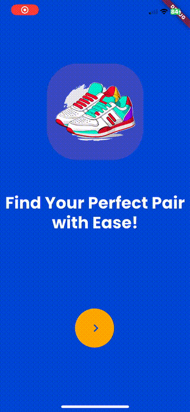

  

  
  
  
  

### Wagwan,

Just a Mobile Software Engineer that wants do quality stuff.

### :hammer_and_wrench: Languages and Tools :

  &nbsp;
  &nbsp;
  &nbsp;  
  &nbsp;
  &nbsp;
 &nbsp;
<!--   &nbsp; -->
 &nbsp;
 &nbsp;
<!--  &nbsp; -->
  &nbsp;
  &nbsp; 

### :fire: My Stats :
* 
* 

## Animations

<table style="width: 100%; table-layout: fixed;">
    <tbody>
        <tr>
            <th>Food Store</th>    
            <th>Men's Fashion</th>
        </tr>
        <tr>
            <td style="text-align: center;">
                </img>
            </td>
	            <td style="text-align: center;">
                </img>
        </tr>
        <tr>    
            <th>Sneaker's store</th>    
            <th>Fits</th>
        </tr>
        <tr>
<td style="text-align: center;">
                </img>
            </td>
            </td>
            <td style="text-align: center;">
                </img>
            </td>
        </tr>
    </tbody>
</table>

### :writing_hand: Blog Posts :

[Medium](https://medium.com/@emeleonufavour)

 

 

